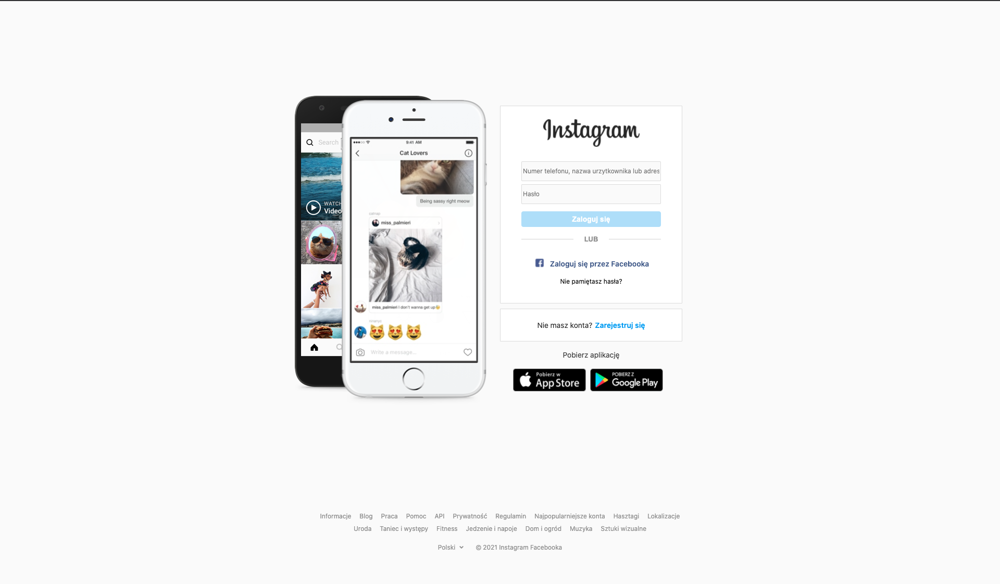

# Bootcamp projects

## Tutaj znajdziesz moje projekty w ramach kursu Junior FrontEnd Developer organizowanego przez infoShare Academy.

- Projekt grupowy Monster Hunt - aplikacja webowa w React
https://monster-hunt-v1.web.app/

 

- Projekt 6 - Aplikacja napisana w JS na potrzeby aktualnej pracy. Plansza procesowa dla Points of You@ Polska.  
  Live Demo: https://annasawickaziolkowska.github.io/PointsOfYou-process-layout-chart/

 

* Projekt 5 - ToDo Lista z timerem zadań. HTML, CSS, JS. Projekt do dokończenia. 
* Projekt 4 - Countdown w JS. Odlicza czas do 24 grudnia 2021 00:00:00.

 

* Projekt 3 - Strona logowania instagram.com 1 do 1 - responsywna i początkowo stworzona wyłącznie poprzez html i css. W późniejszym etapie dodałam elementy JS i zrobiłam rejestrację i logowania, korzystając z Firebase Auth.  
  Live Demo: https://annasawickaziolkowska.github.io/Instagram-Clone-with-Firebase-Auth/  
* Projekt 2 - Szablon strony dla sklepu z kosmetykami. Html i css. Pracuję jeszcze nad wersją mobilną i ostatnimi porawkami estetycznymi.

 

* Projekt 1 - Strona główna dla kawiarni. Pracuję jeszcze nad wersją mobilną i ostatnimi porawkami estetycznymi.

 
 

